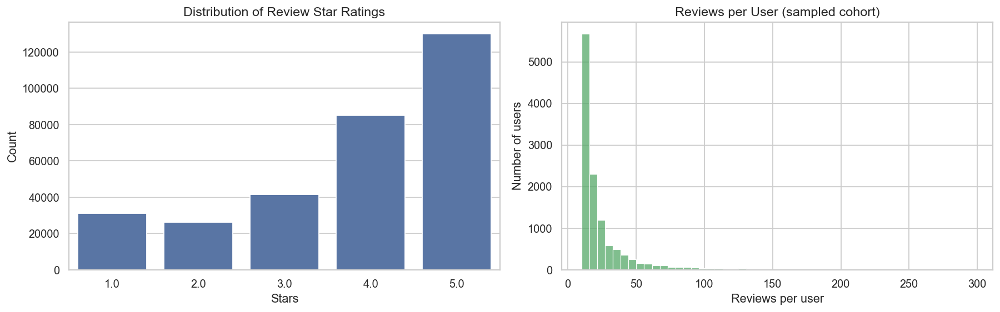
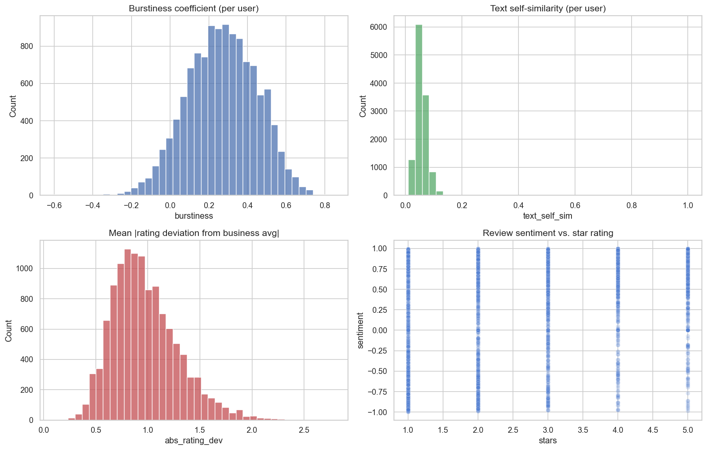
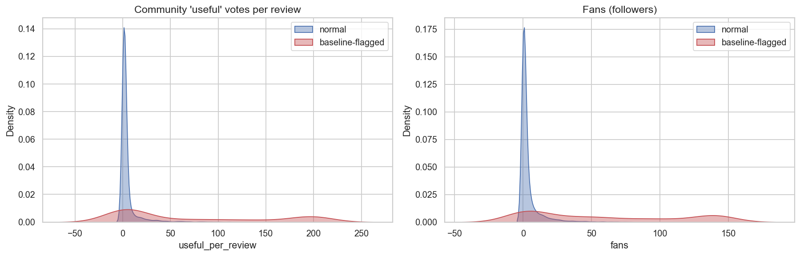
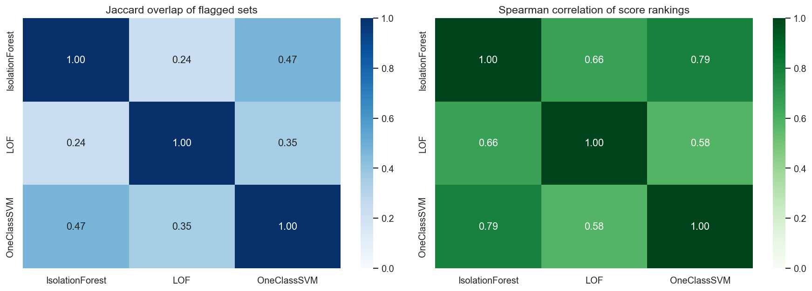
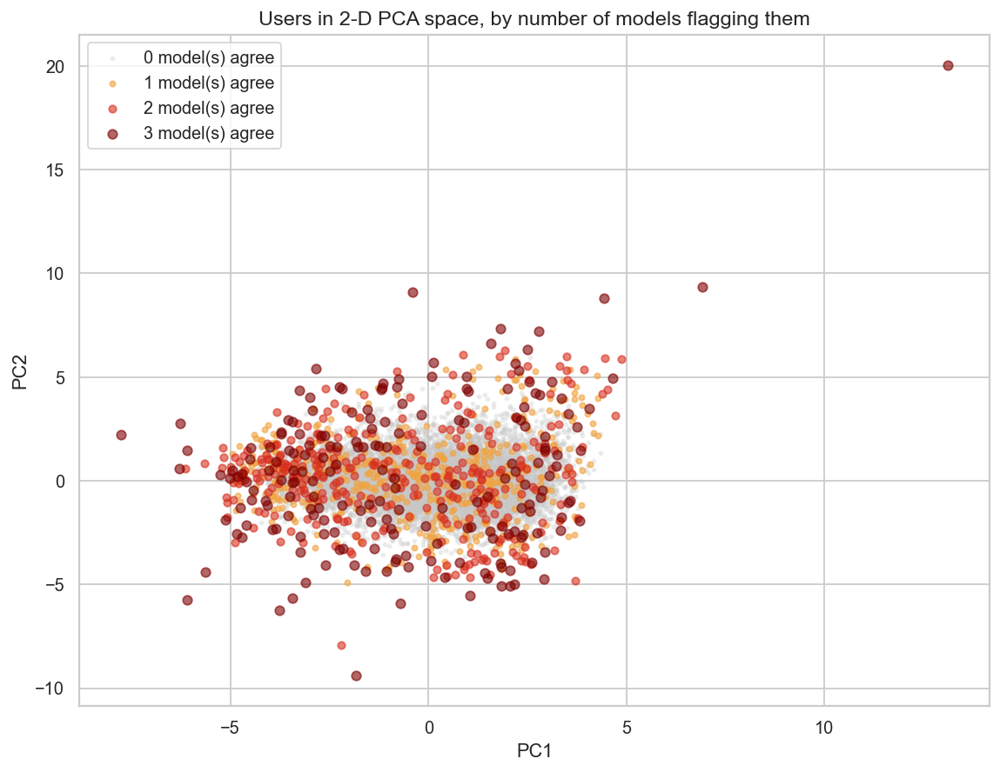
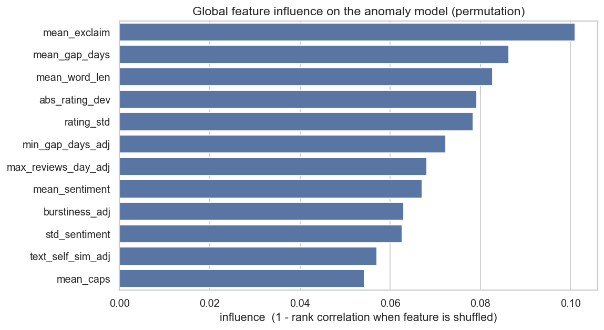
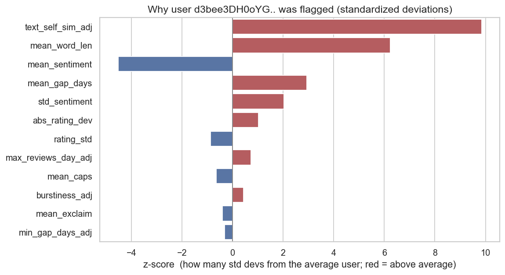

# Detecting Anomalous & Potentially Fraudulent Reviews in the Yelp Open Dataset

**Capstone project — final submission (Modules 21 + 24)**
**Author:** R. Rajagopalan

---

## Executive Summary

**Project overview and goals.** Online reviews steer billions of dollars in consumer spending, which
makes them a target for manipulation. This project builds a system that scans the
[Yelp Open Dataset](https://business.yelp.com/data/resources/open-dataset/) and produces a
**ranked "watch-list" of reviewers whose behavior looks anomalous** — burst posting, templated text,
ratings that fight the consensus — so that a human investigator can prioritize who to examine. Because
the data contains **no labels** marking which reviews are fake, the project is framed as
**unsupervised anomaly detection**: we teach the computer what *normal* reviewing looks like and have
it surface the users who stand out the most.

**Findings.** A naïve anomaly detector is easy to fool: our first (Module 21) model mostly flagged
Yelp's *most popular, most prolific* reviewers — its anomaly score correlated **+0.33 with a user's
number of fans**. After **normalizing for activity level** and combining **three** independent
detectors into a consensus, the system instead flags accounts that **deviate from business-consensus
ratings, recycle near-identical text, and post in machine-like bursts**, while *no longer* simply
re-discovering famous power-users (popularity correlation dropped to **≈0**).

**Results and conclusion.** From a cohort of **12,000 active users (~314k reviews)** the final
ensemble produces a high-confidence watch-list of **426 users (3.5%)** flagged by **at least two of
three models**. Reading their actual reviews validated the signal: the single most-suspicious account
posts **near-duplicate templated reviews** (text self-similarity nearly **10 standard deviations**
above normal); another posted **57 reviews in a single day**. The deliverable is a *prioritized lead
list, not an accusation.*

**Next steps and recommendations.** Add sentence-embedding duplicate detection across the full user
base, model the reviewer↔business graph to catch coordinated *rings* (not just individuals), and
hand-label a small validation set to finally measure precision/recall.

---

## Rationale

Why does anyone care whether reviews are fake? Because reviews move money. Harvard Business School
research found that a **one-star increase in a restaurant's Yelp rating leads to a 5–9% increase in
revenue** (Luca, 2016). That direct link between rating and revenue is exactly the incentive that
fuels review fraud — and the same researchers estimate that roughly **16% of Yelp restaurant reviews
are flagged as fraudulent** by Yelp's own filter, with fraud most likely when a business has a weak
reputation or faces stiff competition (Luca & Zervas, 2016). Regulators have taken notice: in 2024 the
U.S. Federal Trade Commission finalized a rule **banning fake and AI-generated reviews and the buying
or selling of reviews**, backed by civil penalties (FTC, 2024).

When fake reviews go undetected, consumers are misled into bad choices and honest businesses lose out
to manipulators. A tool that narrows millions of reviewers down to a few hundred suspicious accounts
is therefore genuinely useful to a trust-and-safety team — even if it cannot, by itself, prove fraud.

## Research Question

> *Can machine learning identify potentially fraudulent or anomalous reviewers in the Yelp Open
> Dataset using behavioral, temporal, and linguistic patterns?*

A secondary question, which became the heart of the final analysis: *how do we stop an anomaly
detector from simply flagging legitimate power-users, and instead make it flag genuinely suspicious
behavior?*

## Data Sources

**Dataset:** the [Yelp Open Dataset](https://business.yelp.com/data/resources/open-dataset/) — a
4.35 GB compressed download that expands to ~8.65 GB of newline-delimited JSON.

| File | What we use from it |
|------|---------------------|
| `yelp_academic_dataset_review.json` | review text, star rating, timestamp, business id, user id |
| `yelp_academic_dataset_user.json`   | per-user aggregates: review count, average stars, account age, fans, elite years, friends, votes |
| `yelp_academic_dataset_business.json` | each business's pre-computed average star rating (for the rating-deviation feature) |

The full review file holds **6,990,280 reviews** from **1,987,929 users** across **150,346
businesses** (2005-03-08 → 2022-01-19).

**A loading subtlety that mattered.** Per-user temporal features (e.g. "how bursty is this person's
posting?") need each user's *complete* review history. A random sample of reviews would shred everyone's
timeline, so instead we **sample a cohort of users** and then stream the giant review file to collect
*every* review those users wrote. The files are read one line at a time — we never hold a multi-gigabyte
file in memory. From the **116,874** users with 10–300 in-dataset reviews we drew a working cohort of
**12,000 users / ~313,752 reviews** (≈26 reviews/user).

**Exploratory data analysis.** A few shapes in the raw data motivate the whole approach:



- Ratings are strongly **positive-skewed** (4–5 stars dominate) — the familiar positivity bias of
  review platforms.
- Reviews-per-user is **right-skewed**: most users post modestly, a long tail posts far more.



- **Text self-similarity** is the clearest fraud-relevant signal: sharply peaked near zero (most people
  write fresh text) but **heavy-tailed**, isolating users who recycle near-identical reviews.
- **Burstiness** and **rating deviation** are likewise concentrated for normal users with suspicious
  tails, and **sentiment tracks star rating** but with enough spread to expose text-vs-rating mismatches.

## Methodology

The work is split across **two Jupyter notebooks** that read top-to-bottom:

| Notebook | Module | What it does |
|---|---|---|
| **`capstone_eda.ipynb`** | 21 | Loads & cleans the raw data, **engineers 18 per-user features**, explores them with visualizations, and fits a single **baseline** model (Isolation Forest). |
| **`yelp_dataset_final_modeling.ipynb`** | 24 | Diagnoses & fixes the baseline's key flaw, compares **three models**, builds a **consensus ensemble**, explains the flags, and validates them against real review text. |

**The 18 features, grouped by intuition:**

| Family | Features | Why it might signal fakery |
|--------|----------|----------------------------|
| **Linguistic** | review length, sentiment, exclamation & ALL-CAPS ratio, **text self-similarity** | fake reviews are often short, exaggerated, or copy-pasted from a template |
| **Rating** | deviation from the business's average, rating variance | shills push ratings away from consensus, or rate everything identically |
| **Behavioral / temporal** | inter-review gaps, **burstiness**, max reviews/day, account age, fans, friends, useful-votes/review | bots and paid reviewers post in bursts and earn few genuine community up-votes |

**Modeling steps (Module 24):**
1. **Diagnose the "power-user confound"** in the baseline (below).
2. **Activity normalization** — statistically remove the part of each behavior explained by sheer
   review volume, and keep behavioral *shape* rather than raw popularity counts.
3. **Three unsupervised detectors** — Isolation Forest (global trees), Local Outlier Factor (local
   density), One-Class SVM (kernel boundary) — each flagging ~5%.
4. **Tune** the contamination prior and confirm the ranking is stable.
5. **Consensus ensemble** — average the three models' rankings; trust the cases where they agree.
6. **Interpret** the flags (feature importance, global + local) and **validate** with real review text.

## Model Evaluation and Results

### The flaw the baseline exposed

A single Isolation Forest flagged 5% of users — but it was partly a **fame detector**. Its anomaly
score correlated **+0.33 with fans, +0.30 with friend count, +0.26 with community "useful" votes**. The
most-"anomalous" user was a beloved Elite reviewer with 2,600+ fans — the *opposite* of a hidden bot.



Separating *suspicious* from *merely prolific* became the central task of the final notebook.

### The fix worked

After activity normalization, the new consensus score's correlation with popularity **collapsed to
near zero** — the model stopped mistaking fame for fraud:

| Score's correlation with… | Module 21 baseline | Module 24 consensus |
|---|---|---|
| Fans | **+0.33** | **−0.07** |
| Friend count | +0.30 | −0.06 |
| Useful votes / review | +0.26 | −0.04 |

### Three models, combined into a consensus

Each detector independently flagged ~5% (600 / 600 / 602 users). They **agree partially but
meaningfully** — Spearman rank correlation 0.58–0.79, flagged-set overlap 24–47% — which is exactly
why combining them is more robust than trusting any one.



| Models agreeing | Users |
|---|---|
| 0 | 10,924 |
| 1 | 550 |
| **2** | **326** |
| **3** | **200** |

The high-confidence **watch-list is the 426 users (3.5%)** flagged by **≥2 of 3 models** and in the top
5% of the consensus ranking. A contamination sweep confirmed the ranking is **stable** (stricter cutoffs
yield perfectly nested subsets), so the exact 5% threshold is not critical. In the PCA projection below,
the flagged users (orange → dark red as agreement rises) sit on the sparse periphery — the expected
geometry of genuine outliers — and are no longer simply the highest-fan accounts:



### Who gets flagged now

| Signal (median) | Normal user | Flagged user |
|---|---|---|
| Deviation from business's average rating | 0.92 | **1.12** (rates against consensus) |
| Text self-similarity (templated writing) | 0.053 | **0.062** |
| Fans (followers) | 1 | **0** (no longer the popular accounts) |
| "Useful" votes per review | 1.58 | **1.45** |

## Important Findings — Why Each Account Was Flagged (Interpretability)

A watch-list is only actionable if an investigator understands the *reasons*. We explain the
unsupervised model two ways — the analogue of the global/local feature-importance (ELI5/LIME) used for
supervised models.

**Globally**, the model leans on a *balanced mix of the activity-independent shape features* we
engineered — punctuation/length style, posting gaps, rating deviation, burstiness, templated text —
and, by design, **not** on raw popularity:



**Locally**, each flagged user's standardized feature values reveal *which* behaviors are extreme. For
the single most-suspicious account, the explanation is dominated by **templated text at nearly +10
standard deviations**, very long reviews, and unusually negative sentiment — a concrete, human-readable
reason to investigate:



**Reading the raw reviews confirmed the signal is real, not a statistical artifact:**

- The most-suspicious user posted **two near-identical 1-star reviews of the same business on the same
  day** ("If I could give ZERO stars…" / "Why didn't I listen… ZERO stars for Gerhard's") — a textbook
  templated pattern, exactly what the +10σ text-similarity score flagged.
- One flagged account posted **57 reviews in a single calendar day** (and 42 on another) — machine-like
  volume no human writes by hand.
- A **cross-user near-duplicate check** within the flagged cohort found only one matching pair,
  suggesting these are *individually* anomalous accounts rather than one coordinated ring — an honest,
  useful negative result.

The final ranked watch-list is saved to **`data/final_ranked_users.csv`**.

## Important Findings (the short version)

1. **Unsupervised anomaly detection can triage millions of reviewers down to a few hundred leads** —
   practical even with zero labeled examples of fraud.
2. **Naïve anomaly detection is dangerously easy to misread.** Our first model mostly flagged Yelp's
   *best* reviewers; without the diagnostic step we'd have shipped a "fame detector."
3. **Adjusting for activity level is what made the result trustworthy** — it cut the "suspicious ↔
   popular" correlation from ~+0.3 to ~0.
4. **Model agreement is a credible substitute for labels** — where three different algorithms converge
   *and* the raw text shows duplicate or burst behavior, the lead is strong.
5. **The output is a watch-list, not an accusation.** Every flag is a starting point for human review.

## Limitations

- **No ground truth.** Without labeled fake reviews we cannot compute precision/recall; flags are
  *candidates for investigation*, not confirmed fraud.
- **Cohort and threshold dependence.** Results reflect the sampled 12,000-user cohort and a 5%
  contamination prior.
- **Lightweight NLP.** VADER sentiment and TF-IDF similarity are solid baselines but miss paraphrased
  duplicates; modern sentence embeddings would catch more.

## Next Steps and Recommendations

- **Stronger NLP:** sentence-embedding near-duplicate detection across the *entire* user base to surface
  campaigns that reuse paraphrased text.
- **Graph signals:** model the reviewer↔business network to detect *rings* of accounts targeting the
  same businesses, not just individual outliers.
- **A small labeled validation set:** hand-label a few hundred flagged vs. normal accounts to finally
  put real precision/recall numbers on the system and tune the threshold.
- **Productionization:** wrap the consensus model in a scheduled job emitting a ranked daily watch-list
  for a trust-and-safety team.

## Repository Structure

```
.
├── README.md                          # this report (non-technical summary)
├── README_previous.md                 # report submitted as part of Module 21 deliverable
├── notebooks/yelp_dataset_eda.ipynb            # Module 21: cleaning, feature engineering, EDA, baseline
├── notebooks/yelp_dataset_final_modeling.ipynb # Module 24: model comparison, consensus, interpretability, case studies
├── images/                            # figures embedded in this README (saved by the notebooks)
└── data/
    ├── Yelp-JSON.zip                   # raw download (gitignored — large)
    ├── yelp_academic_dataset_*.json    # extracted raw data
    ├── ranked_suspicious_users.csv     # Module 21 output: engineered feature matrix + baseline
    └── final_ranked_users.csv          # Module 24 output: final consensus watch-list
```

## References

- Luca, M. (2016). *Reviews, Reputation, and Revenue: The Case of Yelp.com.* Harvard Business School
  Working Paper 12-016.
- Luca, M., & Zervas, G. (2016). *Fake It Till You Make It: Reputation, Competition, and Yelp Review
  Fraud.* Management Science, 62(12), 3412–3427.
- U.S. Federal Trade Commission (2024). *Rule on the Use of Consumer Reviews and Testimonials* (16 CFR
  Part 465) — banning fake and AI-generated reviews.
